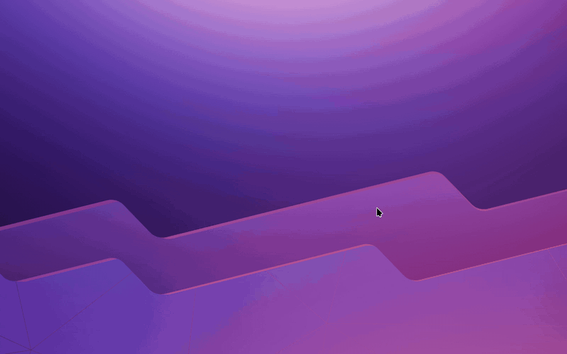
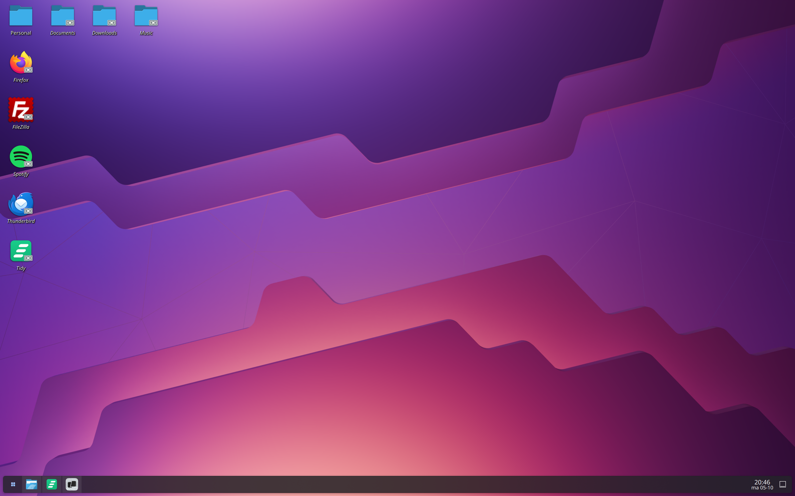
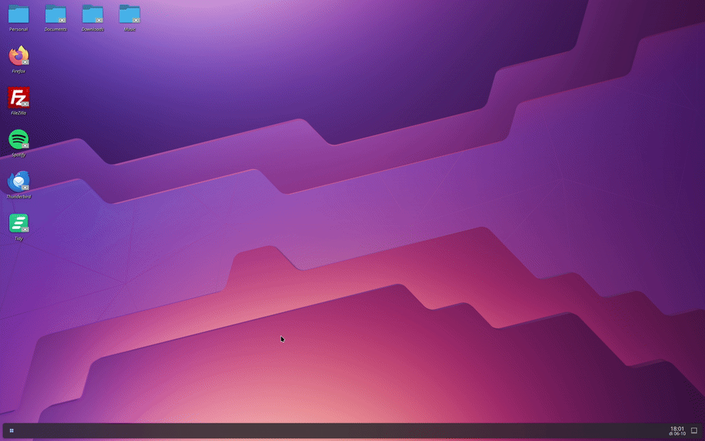
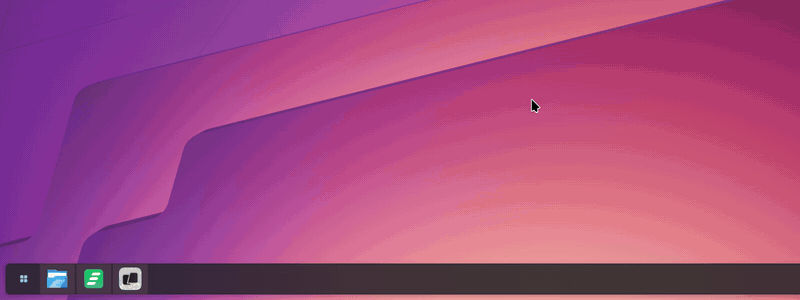
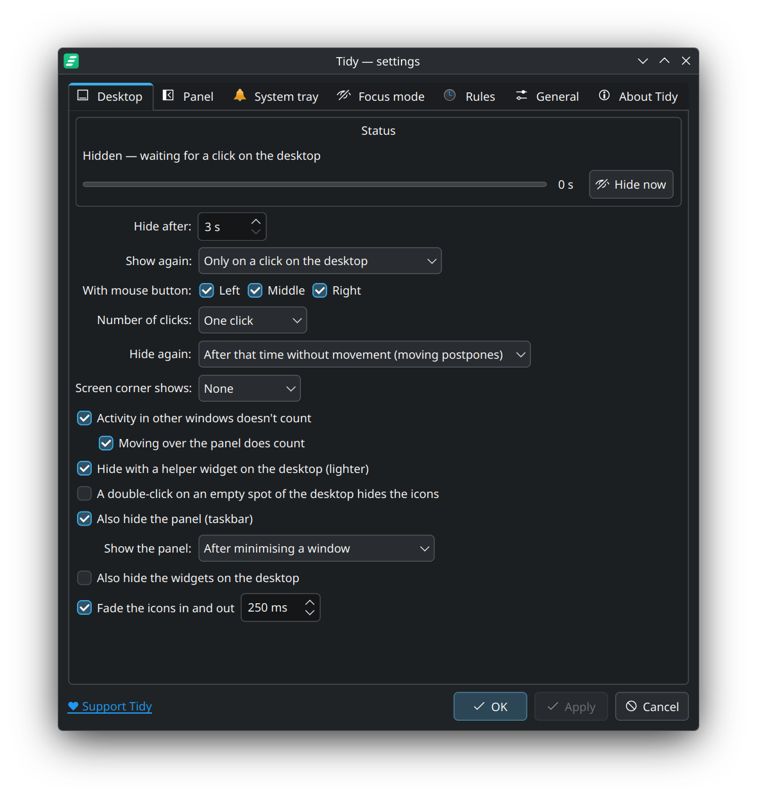
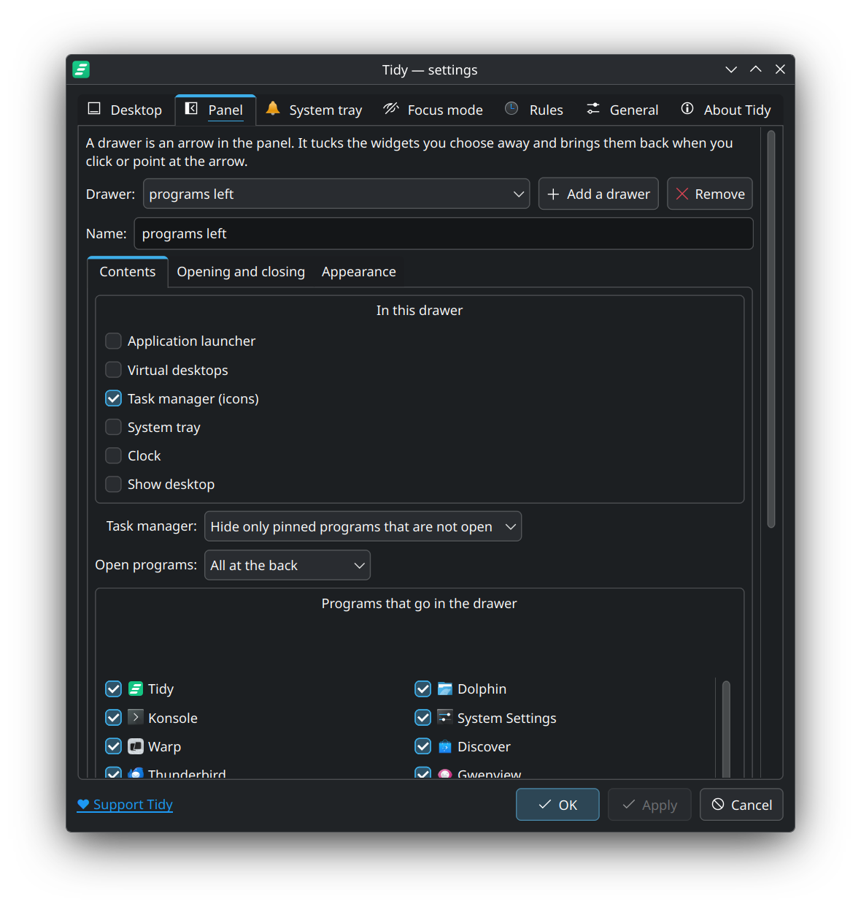

# Tidy (plasma-tidy)

Tidy keeps your KDE Plasma desktop, panel and system tray clean.



- **Desktop:** hides your desktop icons when you're not using them, and brings them back on
  mouse movement, a click on the desktop, a screen corner or a shortcut.
- **Panel:** a drawer, an arrow in the panel, tucks the programs and widgets you choose away
  and brings them back on a click or when you point at it.
- **Focus mode:** one shortcut hides the icons, closes the drawers and trims the system tray,
  and keeps it that way until you switch it off.
- **System tray:** choose per icon whether it's shown, hidden under `^`, automatic or disabled.
- **Rules and profiles:** keep sets of settings as profiles, and let Tidy switch between them
  by itself: on battery, with an external screen, at certain hours, per program, virtual
  desktop or activity.
- **Peek:** hold a key to see everything for a moment; let go and it is tidy again.
- **Balloons and previews:** switch Plasma's text balloons off, and choose what a program in
  the panel shows when you point at it: a preview with or without its title, text only, or
  nothing.

Each part is optional: Tidy only changes what you switch on. Out of the box it hides and
shows the desktop icons and leaves your panels and system tray as they are.

It lives in the system tray as a small icon of three slanted bars and stays out of the way:
it never steals focus, and it waits while you have a menu open or are editing your desktop.

The interface is available in English and Dutch. It follows your system language unless you
pick one in the settings.

## Why

I like a calm screen: a clean desktop that shows things when I reach for them and is empty
when I don't. On Windows a small tool hid my desktop icons until I needed them, and I missed
it on Plasma, which can hide a panel but not the icons. So I built that. The panel drawers,
the system tray settings and focus mode grew out of the same wish.

## What it looks like

| Icons hidden | Back on a click |
|---|---|
|  |  |

A drawer in the panel opens on a click on an empty spot and closes when the pointer leaves:



The same drawer as a pop-up above the panel:



| Desktop settings | Panel settings |
|---|---|
|  |  |

## Requirements

- KDE Plasma 6 on **Wayland** (X11 is not supported)
- A desktop that uses the *Folder View* layout (the Plasma default when you have desktop icons)
- `python3-pyqt6` and `swayidle`

Tested on Fedora 44 with Plasma 6.7, and reported working on an Arch-based system. Other
distributions should work with the equivalent packages.

**This is a first release, made and tested by one person on one laptop, so expect bugs.** Not
tried yet, or only a little: a panel on the left, a right-to-left language, and rules that
switch by themselves (the charger, the clock). A second screen has been tried once, with one
television. If something goes wrong, *Restore everything* puts your desktop back (see
*Troubleshooting*), and a report in the
[issue tracker](https://github.com/wispware/plasma-tidy/issues) helps: `plasma-tidy --report`
gives what is needed for one.

## Install

On Fedora, from [COPR](https://copr.fedorainfracloud.org/coprs/wispware/plasma-tidy/):

```sh
sudo dnf copr enable wispware/plasma-tidy
sudo dnf install plasma-tidy
```

On another distribution, or to try the latest code, install from source:

```sh
sudo dnf install python3-pyqt6 swayidle   # Fedora
sudo pacman -S python-pyqt6 swayidle      # Arch; elsewhere, your distribution's packages

git clone https://github.com/wispware/plasma-tidy.git
cd plasma-tidy
./build.py --install
```

That packs the code in `src/` into the single file `~/.local/bin/plasma-tidy` and adds Tidy to
the application menu. The menu entry names the program by its full path, so it also works
where `~/.local/bin` is not on the `PATH` of the desktop session (Arch, for one).

Either way, start **Tidy** from the application menu. To have it start when you log in, leave
*Start at login* ticked in the welcome window, or tick it in the settings. Started from a
terminal with `plasma-tidy`, it stops when you close that terminal, like any program.

## Using it

Tidy shows its icon in the system tray, three slanted bars: plain when your icons are
visible, dimmed with a stroke through it when they are hidden or focus mode is on, grey when
Tidy is switched off. Click it to open the settings; right-click for the menu.

Switching Tidy off (*Enabled* in the menu) or choosing *Quit* leaves your desktop as it is
without Tidy: the icons are shown, the drawers are paused with everything in them in view,
and Plasma's balloons and pop-ups are back as they were. Your settings are kept; switching
Tidy on, or starting it again, takes up where it left off. Logging out is not quitting: the
drawers are left as they are, so nothing jumps when Tidy starts with your next session.

The first time Tidy starts, a welcome window asks the things that matter most: after how
long the icons hide, what brings them back, and whether Tidy starts at login. It also offers
to add a drawer for the programs in your panel and to tidy the system tray; both are off
unless you tick them. Everything else is in the settings, and *Welcome window…* on the
*General* tab shows the window again.

In the settings window, *Apply* puts your changes to work and keeps the window open, so you
can try them out; *OK* does the same and closes it. *Apply* becomes available as soon as you
change something.

### Desktop

| Setting | What it does | Default |
| --- | --- | --- |
| Hide after | Seconds without activity before the icons disappear | 10 s |
| Show again | On any mouse movement or key press, or only on a click on the desktop | movement or key |
| With mouse button | Which buttons count as a click on the desktop (left, middle, right) | all three |
| Number of clicks | With a click on the desktop: one click, or a double-click | one click |
| Hide again | After that time without movement, or after a fixed time even while you move | without movement |
| Screen corner shows | Moving the mouse into this corner shows the icons | none |
| Activity in other windows doesn't count | The icons hide behind the window you're working in: what you type or do there does not postpone hiding. Moving the mouse over the desktop itself always does | on |
| Moving over the panel does count | With the setting above: moving the mouse over the panel keeps the icons too, like moving over the desktop | on |
| Hide with a helper widget on the desktop (lighter) | An invisible widget on the desktop makes the icons go and come: at once, without extra memory and without writing to disk. Off: Tidy swaps the desktop's folder for an empty one instead, which needs nothing inside Plasma. See *How it works* | on |
| A double-click on an empty spot of the desktop hides the icons | Hides them at once, without waiting for the timer; needs the helper widget | off |
| Also hide the panel (taskbar) | Auto-hides the panel while the icons are hidden | off |
| Show the panel | A panel that is hidden, by Tidy or by itself, comes into view after you minimise a window, or after you minimise or close one, so you can go straight to the next program. It goes again after the time the icons take to hide, and stays while the pointer is on it | never |
| Also hide the widgets on the desktop | Clocks, notes and other widgets on the desktop go and come with the icons. With widgets on the desktop, a list below it lets you choose per widget: without a tick it stays in view. Needs the helper widget | off, all widgets |
| Fade the icons in and out | The icons fade away and back instead of switching at once, in the time you set; needs the helper widget | off, 300 ms |
| Hide the icons on | With more than one screen: the screens whose icons are hidden; the others keep theirs | every screen |

*Show desktop* (Meta+D) always brings the icons back.

If the screen corner you pick already has an action in System Settings → Screen Edges, both
will fire.

### Panel

The *Panel* tab adds drawers to your panel. A drawer is a small arrow that tucks the widgets
you choose away. Click the arrow to close or open the drawer. If you like, it also opens when
you point at the arrow, and closes by itself or on a click on an empty spot of the panel.

*Add a drawer* puts one just before the task manager, with the task manager in it; a second
drawer starts with the system tray. The arrow sits next to the widgets it hides and moves
along when you change them. To place it yourself, choose *Where I put it myself*, right-click
the panel, choose *Enter Edit Mode* and drag it.

You can give a drawer a name; without one it is called after what is in it. The name shows in
the list of drawers and in the arrow's balloon.

The settings of a drawer come in three parts.

*Contents*

| Setting | What it does | Default |
| --- | --- | --- |
| In this drawer | Which of the panel's widgets the drawer hides | the task manager |
| Add a folder… | Puts a folder in the panel, in this drawer, for quick access: a click on it shows what is in the folder. It is Plasma's own *Folder View* widget, called after its folder in the list. The × next to it takes it out of the panel again | none |
| Task manager | Hide only the pinned programs that are not open, so open programs stay in the panel; or all programs, open ones too | only pinned programs that are not open |
| Open programs | Where open programs stand in the task manager: on their pinned spot, all in front, or all at the back | pinned spot |
| Programs that go in the drawer | Per program of the task manager: in the drawer, or kept in the panel also while the drawer is closed | all of them |

*Opening and closing*

| Setting | What it does | Default |
| --- | --- | --- |
| Open with | A click on the arrow, or pointing at it (a click always works) | click |
| Pointing opens after | How long the pointer must rest on the arrow | 200 ms |
| Shortcut | A key for this drawer alone | none |
| Open when a program asks for attention | A hidden program that wants you opens the drawer | on |
| Open with a click on an empty spot in the panel | A left click where the panel is empty opens the drawer. As long as a drawer that opens this way is closed, the click only opens; it closes when all of them are open | off |
| Open when the desktop is shown | Opens when you go to the desktop; needs Tidy running | off |
| Close by itself | Never, when the pointer leaves the drawer (the arrow and the items it shows), or when it leaves the panel | never |
| Closes after | How long after the pointer left | 2 s |
| Close with a click on an empty spot in the panel | A left click where the panel is empty closes the drawer; a click on a widget does what it always did | off |
| Close after a click on something in the drawer | Closes once you have started or picked something; a pop-up it opened is waited for | off |
| Panel stays after starting a program | A panel that hides itself or dodges windows goes the moment the window of a program you start from the drawer opens. With a time here it stays that long, so you can go on in the panel | 0 s (it goes at once) |
| Close when a window that fills the screen comes to the front | Closes each time a maximized or full-screen window becomes the active one | off |
| Close when the panel slides out of view | When the panel hides (auto-hide, dodging a window, or hidden together with the desktop icons) the drawer closes, so the panel comes back tidy. It does not open again by itself. Tidy tells the drawer, so Tidy has to be running | on |

*Appearance*

| Setting | What it does | Default |
| --- | --- | --- |
| Icon | Arrow, double arrow, triangle, dots, menu lines, grip, an icon or image of your own, or none at all: the spot then stays clickable and lights up under the pointer | arrow |
| Without an icon the arrow takes no room in the panel | The empty spot goes, and with it pointing at it and clicking it. Only while the drawer can be opened another way: a click on an empty spot of the panel, a shortcut, or when the desktop is shown. The room is back while you edit the panel and while the drawer is paused | off |
| Its room comes back while the mark has something to tell | On: the spot returns to show the mark, so the panel shifts a little at that moment. Off: the mark is not shown | on |
| Mark on the closed drawer | A dot on the arrow when hidden programs are open, their number, a dot only when one asks for attention, or nothing. Applies when the drawer hides a task manager with all its programs | a dot |
| Arrow points the other way | Closed, the arrow points the way the drawer opens: away from the nearest end of the panel. This flips it | off |
| Place of the arrow | Just before the items it hides, just after them, or where you put it yourself | just before |
| Shows its contents | In the panel: what is in the drawer slides out next to the arrow. In a pop-up above the arrow: it stays out of the panel and comes up in a small window, so the panel never changes size | in the panel |
| Pop-up | For programs: a row of icons, a column of icons standing on the arrow, a grid with names, or a list with names. A row or a column is as thick as the panel, with icons as large as the panel's. Drag a program to another place to change the order, as in the panel. Other widgets keep their own shape | a row |
| Place of the pop-up | Above the arrow, or at the start, in the middle or at the end of the panel, wherever the arrow is. The pop-up ends where the panel ends; at the edge of the screen a pointer pushed against that edge is on the icons | above the arrow |
| Pop-up has a background, like the panel | On: the pop-up looks like a piece of your panel. Off: only the icons, on whatever is behind them | on |
| Pop-up floats above the panel, like Plasma's own pop-ups | On: the same distance from the panel as the start menu and the system tray's own pop-up, so they line up. Off: it stands on the panel's edge. Only a floating panel shows the difference | on |
| The system tray's own arrow (^) | With the system tray in a pop-up only its icons go there. Its own arrow, for the icons it keeps hidden, shows in the panel while the pop-up is open, always, or never | while the pop-up is open |
| The arrow shows a balloon when you point at it | Off: no text balloon at the drawer's arrow | on |
| Animation | Slide: the icons of a task manager slide out from under the arrow at their normal size, like a drawer. Grow: they grow from small to their normal size. One by one: they come and go one after the other. Fade: they fade together and the rest closes up | slide |
| Speed | How long the movement takes; one by one, how long each icon takes | 250 ms |

Below the drawers, *All drawers: close and open together with the desktop icons* makes every
drawer follow Tidy's hiding and showing of the desktop icons (off by default).

Under that, *Balloons and previews* is about what comes up when you point at something in the
panel. The balloons switch and the pop-up with or without a preview are Plasma's own settings,
shown as they are now; the rest is done by a drawer:

| Setting | What it does |
|---|---|
| Plasma shows a balloon with text when you point at something | Plasma's switch for every text balloon in the panel, the system tray and on the desktop. Off: none of them appear. The pop-up of a program in the panel is the setting below, and can stay |
| Pop-up of a program in the panel | *With a preview of the window*, *Title and text only* (both are the task manager's own setting), *Only the preview of the window* (no title or text, and the close button stays above the preview if you tick *With only the preview: keep the close button, above it*) or *None*. Only the preview, no pop-up at all, and a pop-up while Plasma's balloons are off, are done by a drawer, so they work for a task manager that is in a drawer. A program that is not open has no window to preview: it shows its name, as long as Plasma's balloons are on |
| Balloons float above the panel, like Plasma's own pop-ups | On: the balloons of what is in the panel keep the same distance from it as the start menu and the system tray's own pop-up. Off: against the panel, as Plasma puts them. Only a floating panel shows the difference; works in a panel that has a drawer |
| This pop-up floats above the panel, like Plasma's own pop-ups | The same for the pop-up of a program |

A drawer also has a settings page of its own: right-click the arrow and choose *Configure Tidy
Drawer*. It has the same settings except the place of the arrow, and it works when Tidy is
not running.

A task manager is not hidden as a whole: its icons are, one by one, so they can slide away
smoothly. The task manager itself keeps its place, and the rest of the panel does not jump.
Other widgets give up their space.

**A panel that is as long as its contents** (*Fit content* in Plasma's panel settings) changes
size when a drawer opens, and Plasma does that in a jump. For such a panel, choose *In a pop-up
above the arrow*: the drawer then keeps its programs out of the panel and shows them in a
small window above the arrow when you click or point at it. A click starts the program or goes
to its window, a middle click opens a new window. The pop-up never takes the keyboard from the
window you are working in, and it closes when the pointer leaves it. Any other widget in such
a drawer, the system tray for instance, is itself moved into the pop-up while the drawer works
this way and does what it does in the panel. Of the system tray only the icons move: they stand
one above the other in the *column* and *list* styles. The tray's own `^` arrow, for the icons
it keeps hidden, shows in the panel while the pop-up is open, or always, or never, as you set
it. Without the pop-up, Tidy lets the icons fade in such a panel instead of slide, and
switches off the two options for a click on an empty spot: there is none.

With *Open programs* in front or at the back, the open programs stand together and the pinned
ones slide out next to them, instead of appearing in between.

With the arrow *just after* a task manager, it sits right behind the last program. For that
the task manager stops filling the panel (its own *Fill free space on panel* setting) and the
drawer fills it instead; the setting is put back when you move the arrow or remove the drawer.

With *only the pinned programs*, open programs stay in the panel and only the icons of pinned
programs that are not running slide away. Start one of them some other way and its icon
appears.

The list of programs to choose from holds what the task manager showed last: your pinned
programs and the ones that were open. A program you untick stays in the panel, whether it is
pinned or open. The list is filled a moment after the drawer got a task manager, so open the
settings again if it is still empty.

### System tray

The *System tray* tab lists every icon in your system tray. For each one, choose:

- **Automatic**: visible only when relevant
- **Show**: always visible in the panel
- **Hide**: only reachable through the `^` arrow
- **Off**: switched off completely (Plasma's own items only; icons that belong to an
  application can be shown or hidden, not switched off)

The buttons below the list set every icon at once. Nothing changes until you press *Apply* or
*OK*.

- **Minimal**: network, volume and battery shown; notifications, devices, camera and Caps Lock
  indicators automatic; everything else hidden
- **Show all**, **Hide all**, **All automatic**: every icon on that choice; items that are
  switched off stay off
- **Plasma default**: everything switched on and automatic
- **Save as my preset** and **My preset**: keep an arrangement of your own and apply it again
- **Undo**: back to how the list was when you opened the window

The search field above the list narrows it down by name.

With *New icons go under the ^ arrow by themselves*, an application that shows a tray icon for
the first time gets it hidden. Icons you already had are left as they are. It works while Tidy
is running.

*Add a rule for a name* decides per application: an icon whose name contains the text you type
is always shown, hidden or automatic. A rule is used on the icons that are there when you
make it, and afterwards each time such an icon shows up for the first time; it goes before the
choice above. The first rule that fits counts.

### General

| Setting | What it does | Default |
| --- | --- | --- |
| Start at login | Adds or removes the autostart entry | off; the welcome window has it ticked |
| Language | System language, English or Nederlands; takes effect at once | system language |
| Hold to peek | A key that shows the desktop icons and everything in the drawers for as long as you hold it; also in focus mode. Choose a combination with Ctrl, Alt or Meta: a key on its own would stop working in every program, and Tidy warns you about that | none |
| A peek also shows the panel, on top of your windows | A panel that hides by itself or sits behind a window comes into view during a peek; your windows keep their size. A program in full screen stays on top of the panel | on |

**Profiles** keep all settings together: the desktop, the drawers, the system tray and focus
mode. *Save current as…* stores what is in the window under a name; *Apply* switches to a
profile, and so does the *Profiles* menu of the tray icon. A profile changes the settings of the
drawers that are in your panel; it does not add or remove drawers.

*Export…* writes all settings and profiles to a file and *Import…* reads them back, for
instance on another computer. *Defaults…* puts every setting back to how Tidy comes: your
drawers stay, with what is in them, and the system tray is left alone.

*Restore everything* is on this tab too.

### Rules

A rule uses one of your profiles, or switches focus mode on, for as long as something is the
case:

| When | Applies |
| --- | --- |
| On battery / On mains power | While the computer runs on its battery, or on the charger |
| An external screen is connected | While more than one screen is in use |
| Between these times | Between the two times you set, also across midnight |
| This program is in front | While a window of that program is the active one |
| A program fills the whole screen | While the active window is in full screen |
| On this virtual desktop / In this activity | While you are on it |

For the profile, the highest rule that applies decides; move a rule up or down with its
arrows. *Otherwise* names the profile for when no rule with a profile applies. Focus mode is
on while any rule that asks for it applies, and goes off again when none does.

A profile is put to use at the moment the choice changes. What you change by hand afterwards
stays until the next change, so save it in the profile if you want to keep it. A ✓ in front
of a rule shows that it applies right now. Rules work while Tidy is running and switched on,
and they are part of an export.

### Focus mode

Focus mode tucks everything away at once and keeps it away: the desktop icons are hidden, the
panel drawers closed and the system tray set to *Minimal*, and nothing comes back on mouse
movement, a click on the desktop or the screen corner. Switch it on and off in the tray menu,
on the *Focus mode* tab, with a shortcut or with `plasma-tidy --focus`. Switching it off puts
everything back as it was.

| Setting | What focus mode does | Default |
| --- | --- | --- |
| Hide the desktop icons | Hides them and keeps them hidden | on |
| Close the panel drawers | Closes every drawer; a drawer still opens on its arrow | on |
| Set the system tray to Minimal | Network, volume and battery visible, the rest under `^` | on |
| Auto-hide the panel | The panel slides away until you move to the screen edge | off |

Changing a setting in the settings window (OK or Apply), switching Tidy off, and *Restore
everything* end focus mode; a rule that still applies switches it on again. After a crash or
a logout in focus mode, Tidy puts everything back the next time it starts.

### Restore everything

*Restore everything* (in the tray menu and on the *General* tab) puts your desktop
back as if Tidy were not there. It shows the desktop icons, the panel and everything in the
drawers, and puts back the Plasma settings Tidy changed: the desktop folder, the panel's
visibility, a task manager's pinned list and *Fill free space on panel*, and the balloons and
pop-ups of *Balloons and previews*. If you tick the
box, the system tray goes back to how it was before Tidy first changed it.

Tidy is then switched off and the drawers are paused: their arrows stay in the panel, dimmed,
and hide nothing. Switch Tidy on again in the tray menu, or click an arrow, to resume. Your
settings are kept.

### Shortcuts and command line

Tidy has six actions you can bind to a key in System Settings → Keyboard → Shortcuts →
Add New → Application → Tidy: show the icons, hide the icons, switch Tidy on or off, focus
mode on or off, open or close the panel drawers, and restore everything. The key to hold for
a peek is set in Tidy itself, on the *General* tab.

The same actions are available from the command line. Only one copy of Tidy runs at a time; a
second call passes its command to the running one.

```
plasma-tidy             start Tidy, or open the settings if it is already running
plasma-tidy --show      show the icons now
plasma-tidy --hide      hide the icons now
plasma-tidy --toggle    switch Tidy on or off
plasma-tidy --settings  open the settings
plasma-tidy --welcome   show the welcome window again
plasma-tidy --focus     switch focus mode on or off
plasma-tidy --peek      show everything; run it again to tidy up again
plasma-tidy --drawer-open    open the panel drawers
plasma-tidy --drawer-close   close the panel drawers
plasma-tidy --drawer-toggle  close them if one is open, otherwise open them
plasma-tidy --restore   restore everything and switch Tidy off (does not touch the tray)
plasma-tidy --check     tell which parts work in this Plasma (see Limitations)
plasma-tidy --report    everything for a bug report in one block, without personal data
plasma-tidy --version   print the version
```

## How it works

- **Hiding** is done by a helper: a small, invisible widget that Tidy puts on each desktop.
  Tidy tells it over the session bus (D-Bus) that the icons should go or come, and the helper
  makes the layer of icons see-through and unreachable, with a fade if you like, and the
  desktop's widgets with it. Nothing is written to Plasma's settings for this and the folder
  is not reloaded, so it is instant. While the icons are away the helper catches the click
  that brings them back; a click with a button you did not choose does what it always did.
  When Tidy stops, the helper shows everything again by itself.
- **Without the helper** (switched off, or a Plasma in which it does not work) Tidy hides the
  other way: it points the desktop's Folder View at an empty folder and lays an invisible
  window over the desktop for your click. The original folder is saved first and put back
  when the icons are shown, when you quit Tidy, when you log out, and (after a crash) the
  next time Tidy starts. This way needs nothing inside Plasma, but it reloads the desktop,
  writes to its settings each time, and the window costs about 20 MB while the icons are
  hidden. Fading, hiding desktop widgets and the double-click are not available this way.
- **Idle time** comes from `swayidle`, which uses the Wayland idle-notify protocol. It only
  runs while it is needed: with the icons in view, or when movement is what brings them
  back, and not while you work in another window and that does not count. Tidy does not
  poll: it sleeps until something happens, or until the moment the icons are due to hide.
- **A small KWin script**, loaded while Tidy runs, tells Tidy whether the desktop is the
  active window, and when the pointer moves over the desktop while another window is the
  active one (it looks at most twice a second). It also tells when a menu opens or the
  last one closes and when a panel slides out of view, and handles the screen corner. It
  only tells changes, and it never sees what you type or click.
- **The drawer** is a small Plasma widget that ships inside Tidy and is written to
  `~/.local/share/plasma/plasmoids/` when Tidy starts. Plasma offers no way to hide another
  widget, so the drawer reaches into the panel's layout and makes its neighbours invisible; in
  a task manager it does that per icon. It changes one setting of a task manager, and only
  when you ask for it: with the arrow *just after* the task manager it switches off *Fill
  free space on panel*, and puts that back when the arrow moves or the drawer is removed. The
  drawer does its work by itself, also should Tidy stop unexpectedly; Tidy is only needed to
  change its settings, for a peek, for opening when the desktop is shown, to stay open under
  any menu, and to close when the panel hides. Quitting Tidy or switching it off pauses the
  drawers.
- **Balloons and previews**: Plasma's text balloons are switched with Plasma's own setting
  (`plasmarc`), and the preview in a program's pop-up with the task manager's own. Plasma has
  no setting for the rest, so a drawer that holds the task manager does it, in the same way
  it hides icons: it asks for the pop-up itself when Plasma's balloons are off, keeps it away
  for *None*, and gives the title and the text no room for *Only the preview*. The distance
  to the panel is set on the one window Plasma shows all its balloons in, each time that
  window is about to show something of a panel with a drawer. How Plasma had its settings is
  remembered the first time Tidy changes them.
- **Rules** look at the power supply (UPower), the screens, the clock, the active window and
  virtual desktop (the KWin script) and the activity (KDE's activity manager). Tidy is told
  when one of these changes; it does not keep checking.
- **The peek key** is a global shortcut registered with KDE, which reports both the press
  and the release.

Tidy needs no root access and changes nothing outside your own Plasma configuration.

## How light it is

Measured on Fedora 44 with Plasma 6.7 (memory is PSS, what Tidy really adds to the system):

| | |
|---|---|
| Memory, running in the background | about 24 MB |
| Memory with the settings window open | about 57 MB |
| Memory after the settings window was open | about 36 MB, until Tidy is started again |
| Processor at rest (icons hidden, or you are working in another window) | none: no processor time and not a single wake-up in a minute |
| Hiding and showing the icons once | less than a hundredth of a second of processor time |
| Start-up | well under a second |
| Size | one file of 0.9 MB, plus Python and PyQt6 from your distribution |

Tidy does not poll. It sleeps until something happens (a signal from KWin, Plasma or the idle
watcher) or until the moment the icons are due to hide. `swayidle` only runs while its answer
matters, and the KWin script looks at the pointer at most twice a second.

The drawers and the helper on the desktop are widgets and run inside Plasma itself, so their
share cannot be measured apart from Plasma's. They are event-driven too: nothing in them runs
on a timer while nothing changes.

## Limitations

- Plasma 6 on Wayland only.
- A program for a rule is chosen from the programs that were in front since Tidy started, or
  typed by its window class.
- Tidy postpones hiding while a menu is open or the desktop is in edit mode.
- With *Also hide the panel*, the panel's visibility is a Plasma setting, so that is still
  written to disk each time the icons go and come.
- A second screen has been tried with one television only: hiding and showing on both
  screens, a screen of its own choice (*Hide the icons on*), and unplugging and plugging it
  in while the icons were hidden.
- The drawer and the helper on the desktop depend on how Plasma builds its panel, task
  manager and desktop, which is not a public interface. They are tested with Plasma 6.7, with
  the drawer in a panel at the bottom, at the top and on the right.
  Tidy keeps an eye on this itself: the widgets and the KWin script tell Tidy whether they
  find what they reach into. A part that is not there any more is switched off rather than
  half working (the icons are then hidden the safe way, without fading and the double-click),
  and Tidy says once, in a notification, which parts that are in this Plasma version.
  `plasma-tidy --check` lists every part and whether it works.
- A new version of the drawer or of the helper on the desktop is picked up when Plasma
  starts, so after updating Tidy, log out and in once.
- In a pop-up drawer a program shows its name at most, not a preview of its window: the
  preview comes with an icon that is in the panel itself.
- Closing by itself follows the pointer inside the panel. The pop-up of a program in the
  drawer counts as the drawer, and so does an open menu: the drawer stays until it is gone.
  Close a program from its pop-up and the panel and the drawer stay three seconds, to choose
  something else.
  Tidy tells the drawer of menus; without Tidy running only the menu of a program in the
  drawer is known.

## Troubleshooting

**My desktop icons are gone and don't come back.** Start Tidy again, or quit it from the
tray menu: both restore the original folder. If that doesn't help, right-click the desktop →
Configure Desktop and Wallpaper → Location, and set it back to *Desktop folder*.

**A widget stays hidden in the panel.** Click the drawer's arrow, or remove the drawer in the
*Panel* tab: both bring everything back. Restarting Plasma (log out and in) does too.

**Something is hidden and I don't know why.** Choose *Restore everything* in Tidy's tray menu,
or run `plasma-tidy --restore`.

## Uninstall

Remove your drawers in the *Panel* tab, switch off *Hide with a helper widget on the
desktop*, clear the peek key, and quit Tidy from the tray menu, so your panel and desktop are
as they were. Then remove the program: the package with `sudo dnf remove plasma-tidy`, or
the files of an install from source:

```sh
rm ~/.local/bin/plasma-tidy
rm ~/.local/share/applications/plasma-tidy.desktop
```

And what Tidy keeps in your home folder, with either:

```sh
rm -f ~/.config/autostart/plasma-tidy.desktop
rm -rf ~/.config/plasma-tidy ~/.local/share/plasma-tidy
rm -rf ~/.local/share/plasma/plasmoids/io.github.wispware.plasmatidy.drawer
rm -rf ~/.local/share/plasma/plasmoids/io.github.wispware.plasmatidy.fade
find ~/.local/share/icons/hicolor -name 'io.github.wispware.PlasmaTidy*' -delete
```

## Development

What changed in each version is in [`CHANGELOG.md`](CHANGELOG.md).

The code is in `src/plasma_tidy/`: the program in Python, and in its `data/` folder the two
Plasma widgets, the KWin scripts and the icons as files of their own. `./build.py` packs it
all into the single file `plasma-tidy` (a Python zipapp). To run from the source without
building:

```sh
PYTHONPATH=src python3 -m plasma_tidy
```

`packaging/plasma-tidy.spec` makes the Fedora package (COPR): Tidy goes to
`/usr/share/plasma-tidy`, with a small starter in `/usr/bin/plasma-tidy`.
`data/io.github.wispware.PlasmaTidy.metainfo.xml` is what software centres such as Discover
show of Tidy; its screenshots are in `docs/screenshots/`.

The tests need nothing but Python and PyQt6:

```sh
python3 -m unittest
```

They cover when the icons hide and what postpones that, what Tidy changes in Plasma and puts
back (hiding and showing, focus mode, switching off and quitting, the balloons, a profile),
the rules, what the helper is told, Tidy's look at itself (`--check`), the translations (every
text has one), and that every name the code and the widgets use exists.

## Feedback

Bug reports and ideas are welcome in the
[issue tracker](https://github.com/wispware/plasma-tidy/issues).

## License and support

Made by Ivar. Free and open source under the GNU GPL v3 or later (see `LICENSE`).

Tidy's own icons (`src/plasma_tidy/data/icons/`) are part of Tidy and under the same licence.
The name Wispware and its logo (`src/plasma_tidy/data/wispware.svg`) are not part of that
licence: they say who made Tidy. A changed version you pass on must not carry them as if it
were Wispware's.

If Tidy is useful to you, you can support development at
[ko-fi.com/wispware](https://ko-fi.com/wispware).
